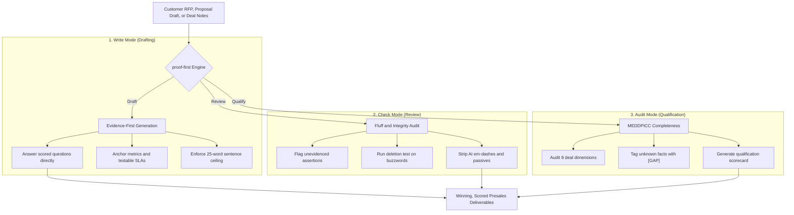

# Proof First: Technical Presales Discipline for Coding Agents

[](https://github.com/cymarechal/technical-presales/actions/workflows/ci.yml)
[](LICENSE)

A coding agent skill for technical presales, RFPs, and solution proposals that eliminates generic AI fluff, enforces real metrics, and catches unverified claims before executive buyers see them.

## Before and after

Every worked example in this repository grounds its numbers in [examples/deal-brief.md](examples/deal-brief.md), an invented mid-market cloud migration scenario. Below is a real comparison from [examples/before-after.md](examples/before-after.md):

**RFP and RFI response**

✗ "Kestrel Systems Group brings decades of experience delivering large-scale cloud transformations for complex, regulated enterprises across many industries. Our proven methodology and world-class team have consistently delivered exceptional outcomes for clients facing challenges like Halverton Mutual's. Before turning to the specific migration approach Question 1 asks for, it is worth noting the breadth of our platform expertise and the strength of our partner ecosystem. Our approach is comprehensive and follows industry best practices, backed by a proven cut-over methodology and rigorous testing."

✓ "Question 1, the highest-weighted scored question in this RFP at 30%, asks for the migration approach and cut-over plan. Kestrel Systems Group moves Halverton Mutual's 850-VM VMware vSphere estate and 40 Oracle Database instances to Amazon EC2 and Amazon Aurora PostgreSQL. Each cut-over runs inside its own scheduled maintenance window. Settlement-batch completion is validated against the required 6-hour window before the next cut-over proceeds."

Rules applied: PF-2.1, MC-11.

| Presales Dimension | ✕ Typical AI Presales Fluff | ✓ Proof-First Presales Response |
| :--- | :--- | :--- |
| **Opening Lead** | Generic vendor pedigree (*"decades of experience"*) | Direct answer citing scored question and weight (30%) |
| **Scope and Inventory** | Vague adjectives (*"large-scale"*, *"complex"*) | Concrete counts: **850 VMs**, **40 Oracle instances** |
| **Architecture** | Empty assertion (*"platform expertise"*) | Target engines: **Amazon EC2**, **Aurora PostgreSQL** |
| **Operational Proof** | Fluff (*"proven cut-over methodology"*) | Testable constraint: **6-hour maintenance window** |
| **Tone and Style** | 87-word marketing preamble, passive voice | Punchy active sentences, max 25 words, zero em-dashes |

> [!IMPORTANT]
> **The Presales Reality:** Evaluators and CFOs discount marketing rhetoric immediately. Proof First forces coding agents to replace empty superlatives with hard metrics, operational constraints, and testable commitments.

`PF-` (prose discipline) and `MC-` (deal qualification completeness) are this project's two rule namespaces. `NUMBERING.md` defines every ID; `skills/proof-first/references/checklist.md` indexes them.

The other three artifact families this skill classifies (solution proposal, executive summary, and demo and discovery material) each have full before/after pairs in [`examples/before-after.md`](examples/before-after.md).

## How Proof First Works



### Rule Families at a Glance

Proof First enforces 32 prose discipline rules (`PF-`) and 8 qualification dimensions (`MC-`):

| Rule Family | Scope and Focus | Core Enforcements |
| :--- | :--- | :--- |
| **PF-1: Quantification** | Concrete metrics, baselines, and numbers | Every capability claim must cite an adjacent figure or baseline |
| **PF-2: Scored Alignment** | RFP question answering and weight prioritization | Address highest-weighted questions first; answer before elaborating |
| **PF-3: Evidence and Verification** | Proof points, references, and testable constraints | Unproven claims require explicit `[GAP]` tags; zero hallucinated facts |
| **PF-4: Prose Discipline** | Technical clarity, tone, and sentence structure | Max 25 words per sentence, active voice, zero em-dashes (`PF-4.5`) |
| **PF-5: Solution Framing** | Architecture, migration, and operational boundaries | State assumptions upfront; specify cut-over maintenance windows |
| **PF-6: Anti-Patterns** | Banned buzzwords and deletion test | Cuts empty adjectives (*"seamless"*, *"world-class"*, *"robust"*) |
| **MC: MEDDPICC Audit** | Deal qualification completeness | Scans metrics, economic buyer, decision criteria, paper process, etc. |

## Install

Proof First installs across coding agents and harnesses with zero dependencies:

### 1. Skills CLI (Universal)

Install with the `skills` CLI ([skills.sh](https://skills.sh)) for Cursor, Codex, Copilot, Gemini CLI, Antigravity, OpenCode, and others:

```bash
npx skills add cymarechal/technical-presales
```

> [!TIP]
> **Universal Agent Detection:** The Skills CLI automatically discovers your installed AI agents and places `skills/proof-first/` directly into their active skills folders. The CLI also accepts a local directory path (e.g. `skills add .`).

### 2. Claude Code Plugin

Install directly from the marketplace manifest:

```bash
claude plugin marketplace add cymarechal/technical-presales && claude plugin install proof-first@proof-first
```

Or inside an active Claude Code session:

```text
/plugin marketplace add cymarechal/technical-presales
/plugin install proof-first@proof-first
```

### 3. Claude Code Output Style

`output-styles/proof-first.md` is a persistent output style generated mechanically from the skill rules. Copy it to your user or project output styles directory:

```bash
mkdir -p ~/.claude/output-styles
cp output-styles/proof-first.md ~/.claude/output-styles/
```

Or copy to `.claude/output-styles/` in your repository root to scope the style to that project. Then select `proof-first` in `/config`.

### 4. Direct System Prompt

For harnesses or tools without native skill support, copy the standalone prompt from `prompts/system-prompt.md` into your custom system instructions or agent prompt file (`AGENTS.md`).

## Quick-Start Prompt Recipes

Proof First operates across three primary workflows:

### 1. Evidence-First Drafting (Write Mode)

Drafts an RFP answer, proposal section, executive summary, or discovery script grounded in supplied customer notes.

> **Prompt:**
> ```text
> Draft an RFP response to Question 2 using Proof First discipline. Here are our discovery notes and customer requirements: [paste notes]. Target family: RFP answer.
> ```

### 2. Proposal and RFP Review (Check Mode)

Audits an existing draft, flagging unevidenced assertions, missing baselines, buzzwords, and compliance commitments before submission.

> **Prompt:**
> ```text
> Review this solution proposal section in check mode. Flag all unevidenced claims, buzzwords, and commitments: [paste draft].
> ```

### 3. Deal Qualification Audit (MEDDPICC)

Runs an independent completeness check against the 8 core qualification dimensions (metrics, economic buyer, decision criteria, decision process, paper process, cost of inaction, champion, competition).

> **Prompt:**
> ```text
> Run a completeness audit on this executive summary against the 8 qualification dimensions. Highlight every gap and provide a status verdict.
> ```

## Status

This repository maintains rigorous mechanical guarantees wired into continuous integration:

- **Rule Registry:** `NUMBERING.md` allocates IDs across 32 prose rules (`PF-`) and 8 qualification dimensions (`MC-`).
- **Integrity Checker:** `tools/check_repo.py` enforces catalog consistency, attribution integrity, citation validity, and frontmatter rules across all files.
- **Mutation Tested:** 58 distinct structural mutations are verified by `tools/check_repo.py --mutation-test`.
- **Fresh Derivatives:** `tools/generate_derivatives.py --check` ensures `output-styles/proof-first.md` and `prompts/system-prompt.md` remain in exact sync with `skills/proof-first/SKILL.md`.

### Benchmark Results

| Evaluation Dimension | Skill-On Wins | Ties | Skill-Off Wins | Measured Takeaway |
| :--- | :---: | :---: | :---: | :--- |
| **Evidence Density** | **45** | 1 | 2 | Wins 94% of pairs; eliminates ungrounded marketing claims |
| **Clarity** | **32** | 3 | 13 | Wins 67% of pairs; enforces 25-word maximum sentence ceiling |
| **Persuasive Force** | 7 | 3 | **38** | Expected tradeoff: trades sales hyperbole for factual density |

<!-- claim-region:start -->

The benchmark ran on 2026-09-18 across `claude-opus-5` and `claude-sonnet-5` and recorded 96
generations. Each scenario was drafted twice, once with the skill loaded and once without, and the
two drafts were judged blind against each other in both orders, with the orders averaged before a
pair was scored. That gives 48 both-orders-averaged pairs per judged dimension. Figures below are
regenerable offline with `python3 evals/benchmark/run_benchmark.py --report-only`.

On evidence, the skill-on draft won 45 pairs, tied 1 and lost 2, measured 2026-09-18 across
`claude-opus-5` and `claude-sonnet-5`.

On clarity, the skill-on draft won 32 pairs, tied 3 and lost 13, measured 2026-09-18 across
`claude-opus-5` and `claude-sonnet-5`.

On persuasive force, the skill-on draft lost 38 pairs. It won 7 and tied 3. The judge preferred the
un-skilled draft in four pairs out of five, measured 2026-09-18 across `claude-opus-5` and
`claude-sonnet-5`, and the direction is the same for both models rather than driven by one.

The mechanical proxy count does not move in one direction at all: across 16 (model, scenario) cells
measured 2026-09-18, the count is lower with the skill on in 8 cells, equal in 1 and higher in 7.
`claude-opus-5` improves and `claude-sonnet-5` worsens, so the two models move opposite ways.

What the persuasive-force result does and does not establish, for the 2026-09-18 run across
`claude-opus-5` and `claude-sonnet-5`: it is one language model's rating against a rubric, and no
human evaluator scored any text. The skill-off condition also received a materially shorter prompt
than the skill-on condition, so prompt length is not held constant between the two arms. Both
caveats are stated in full, with four others, in `evals/benchmark/RESULTS.md`.

One reading of the gap: that the skill trades persuasive framing for evidence density: is an
untested hypothesis, not a measurement. Nothing in the 2026-09-18 run across `claude-opus-5` and
`claude-sonnet-5` tests it. The per-generation texts are in `evals/benchmark/raw/` for a reader who
wants to judge it themselves.

<!-- claim-region:end -->

### Known Limitations

- **No human evaluation:** All benchmark ratings are model-judged rubrics (`claude-opus-5` and `claude-sonnet-5`).
- **Vendor specificity:** Measured exclusively on Anthropic-hosted models.
- **Write-mode conformance residual:** In write mode, live sessions name their artifact family before rule citations in 30.0% of scoreable runs on `claude-sonnet-5` (see `evals/conformance/RESULTS-mod04.md` for full records, methodology, and the v1 disposition decision).

## Keeping derivatives in sync

`output-styles/proof-first.md` and `prompts/system-prompt.md` are derived mechanically. After editing `skills/proof-first/SKILL.md` or any reference file (`checklist.md`, `completeness-audit.md`, `artifact-patterns.md`, `deletion-test.md`), regenerate derivatives:

```bash
python3 tools/generate_derivatives.py
```

CI runs `python3 tools/generate_derivatives.py --check` to prevent stale artifacts from shipping.

## Repository layout

The tree below shows this repository's layout:

```
proof-first/
├── skills/
│   └── proof-first/
│       ├── SKILL.md
│       └── references/
│           ├── checklist.md
│           ├── completeness-audit.md
│           ├── artifact-patterns.md
│           ├── deletion-test.md
│           └── worked-examples.md
├── output-styles/
│   └── proof-first.md
├── prompts/
│   └── system-prompt.md
├── examples/
│   ├── deal-brief.md
│   └── before-after.md
├── evals/
│   ├── pressure-tests.md
│   ├── proxy-sources.md
│   ├── lint.py
│   ├── conformance/
│   │   ├── run_conformance.py
│   │   ├── fixtures/
│   │   ├── transcripts/
│   │   └── RESULTS-mod04.md
│   ├── trigger/
│   │   ├── run_trigger_test.py
│   │   ├── stats.py
│   │   └── RESULTS-trigger.md
│   ├── routes/
│   │   ├── run_routes.py
│   │   ├── raw/
│   │   ├── probe/
│   │   └── RESULTS-routes.md
│   └── benchmark/
│       ├── run_benchmark.py
│       ├── scenarios.json
│       ├── bench-deal-brief.md
│       ├── fixtures/
│       ├── raw/
│       └── RESULTS.md
├── .claude-plugin/
│   ├── plugin.json
│   └── marketplace.json
├── tools/
│   ├── check_repo.py
│   └── generate_derivatives.py
├── .github/
│   └── workflows/
│       └── ci.yml
├── LEGAL-REVIEW.md
├── LICENSE
├── NOTICES.md
├── SOURCES.md
├── NUMBERING.md
└── README.md
```

The skill files live under `skills/proof-first/`. Root-level evaluation suites, tools, and compliance records stay at the repository root and do not ship to an installed agent.

## Rule numbering

`NUMBERING.md` is the authoritative registry for this project's two rule namespaces: a prose-rule prefix for the numbered writing catalog and a separate completeness-audit prefix for the qualification checklist. Numeric ranges are reserved per section before any rule content is drafted, so a rule added later inside its section's range never disturbs an existing citation.

## Versioning

Releases use semantic versioning, matched by a git tag. `NUMBERING.md`'s versioning section states exactly what a patch, a minor, and a major bump each mean for this project's rule catalog.

## License and notices

Everything original in this repository is MIT-licensed. See [LICENSE](LICENSE) for the full license grant.

Attribution notices for borrowed or adapted material appear in [NOTICES.md](NOTICES.md).

```
Concepts here are paraphrased from publicly described sales frameworks. Not affiliated with or endorsed by any framework rights-holder. See NOTICES.md.
```
